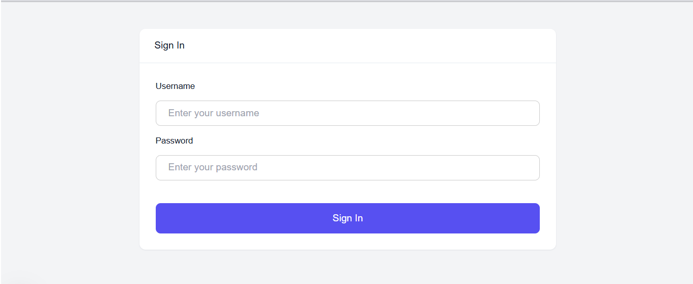
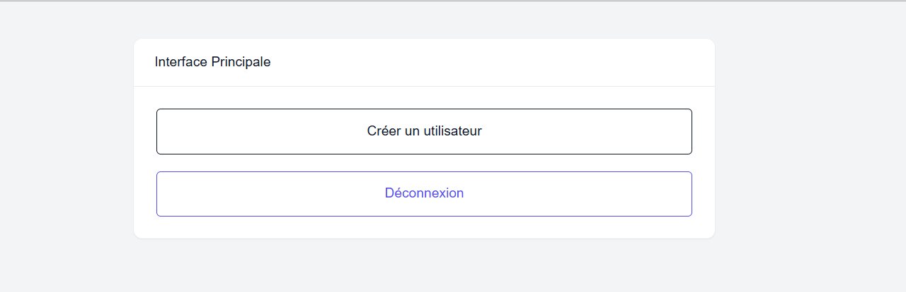

<h1>NextLogin</h1>

Une petite application web développée avec <strong>React</strong>, <strong>Next.js</strong> et <strong>TypeScript</strong> pour le frontend, et <strong>Express</strong> avec <strong>TypeScript</strong> pour le backend. L'application propose une authentification basique avec la possibilité de créer un utilisateur et de se déconnecter.

<h2>🛠️ Technologies utilisées</h2>
<ul>
    <li><strong>Next.js</strong></li>
    <li><strong>CSS / Styled Components / Tailwind</strong></li>
    <li><strong>Fetch API Backend</strong></li>
    <li><strong>Express.js</strong></li>
    <li><strong>MySQL</strong></li>
</ul>

<h2>📌 Crédits</h2>

• Ce projet utilise le template <strong>NextAdmin</strong>.

• <a href="https://github.com/NextAdminHQ/nextjs-admin-dashboard" target="_blank">Lien vers NextAdmin</a>

Merci aux créateurs pour leur travail !

<h2>📌 Fonctionnalités</h2>
<ul>
    <li>✅ Connexion utilisateur</li>
    <li>✅ Création d'un utilisateur</li>
    <li>✅ Déconnexion</li>
</ul>

<h2>🚀 Installation et exécution</h2>
<ol>
    <li><strong>Cloner le dépôt</strong> 
        <code>git clone https://github.com/AndryMSI3/NextLogin.git</code>
    </li>
    <li><strong>Configurer le backend</strong> 
        Avant d'installer les dépendances, créer les fichiers suivants à la racine:
         
        <strong>Fichier <code>.env</code> :</strong>
        <pre>
DB_HOST=le_nom_de_votre_localhost
DB_USER=votre_nom_utilisateur_de_la_base_de_donnée
DB_PASSWORD=mot_de_passe_de_votre_base_de_donnée
DB_NAME=nextLogin
        </pre>
        <strong>Fichier <code>.my.cnf</code> :</strong>
        <pre>
[client]
user = votre_nom_utilisateur_de_la_base_de_donnée
password = mot_de_passe_de_votre_base_de_donnée
        </pre>
    </li>
    <li><strong>Installer les dépendances</strong> 
        <strong>Frontend :</strong> 
        <code>cd client</code> 
        <code>npm install</code> 
        <code>npm run dev</code> 
        <strong>Backend :</strong> 
        <code>cd nodejs-express-mysql</code> 
        <code>npm install</code> 
        <code>ts-node server.ts</code>
    </li>
</ol>

<h2>🏗️ Structure du projet</h2>
<pre>
NextLogin/
│── client/  # Next.js (React + TypeScript)
│── nodejs-express-mysql/   # Express.js (TypeScript)
│── README.md
</pre>

<h2>📸 Aperçu</h2>
<h3>Page de Connexion</h3>

<h3>Page de l'interface principale</h3>

<h2>📜 Licence</h2>

Ce projet est sous licence <strong>MIT</strong>.

